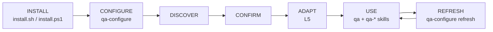

# Architecture

AI-QA is Markdown and configuration only. A target repository gains no runtime dependency, binary, discovery engine or REST client. The LLM reasons, but it follows fixed procedures in framework method files. The project's own tooling runs tests, and external systems are reached through configured transports.

## Lifecycle

## Layers

| Layer | Path in target | Owner | Writer |
|---|---|---|---|
| Entry points | `.github/agents/qa.agent.md`, `qa-configure.agent.md`, `.github/skills/qa-*/` | Framework | Installer |
| Framework | `.github/ai-qa/framework/{method,providers,packs,defaults,templates}/` | Framework | Installer |
| Project Context | `.github/ai-qa/project/project.md`, `discovery.md` | Project | `qa-configure` only (L5) |
| Conventions | `.github/ai-qa/project/conventions/{git,testing,qa-process,integrations,reporting}.md` | Project | `qa-configure` only (L5) |
| Rendered instructions | `.github/instructions/qa-project.instructions.md`, `qa-<pack>.instructions.md` | Project | `qa-configure` only (L5) |
| MCP config | `.vscode/mcp.json` (only if MCP chosen) | Project | `qa-configure` only (L5) |
| Artefacts | `qa-work/<work-id>/` | Project | `qa` and skills (L1) |
| Baselines | `.github/ai-qa/baselines/<date>.md|.json` | Project | `qa-baseline` (L1) |

`project.md` describes **what** the project is: components, stack, environments, dependencies, CI/CD, test landscape, constraints and documentation sources. Each section carries a confidence level and source links. `conventions/*.md` describe **how** AI-QA operates on the project. The two are kept strictly separate.

Precedence: user instruction > project conventions > neighbouring code > pack > framework defaults. Safety gates sit outside this order and no instruction can relax them.

## Agents and skills

- **`qa`** routes a request to one skill or to a named workflow, maintains `qa-work/<id>/index.md` and applies the safety model. It never edits `.github/ai-qa/project/**`. It runs `qa-review-tests` as a subagent where the host supports subagents.
- **`qa-configure`** runs discover → confirm → adapt and builds the Project Context. It identifies Jira and Confluence deployments and has a `refresh` mode.
- **21 skills**: each follows one contract. That contract covers purpose, reads, work-id resolution, inputs (gather the minimum, never refuse), procedure, output with front-matter and index update, side effects with safety levels, and drift handling.

Workflows (`design`, `automate`, `full`, `triage`) are defined in `framework/method/workflows.md`. They are resumable and skippable, and they reuse non-stale artefacts. An artefact is stale when any of its `inputs` is newer.

## Integrations

Skills request **operations** and never call providers directly:

| Level | Operations |
|---|---|
| L0 | `workitem.get`, `workitem.search`, `docs.search`, `docs.get`, `repo.pr.list`, `ci.runs`, `ci.run.get`, `ci.test-results` |
| L4 | `workitem.comment`, `workitem.create`, `docs.publish` (create/update/append), `repo.pr.create` |

`conventions/integrations.md` maps each capability to a provider, deployment and an ordered list of transports. `framework/providers/<provider>.md` holds MCP hints, CLI commands, REST recipes and manual procedures. Cloud vs Server/DC differences live **only** in provider files. If a transport fails, the skill says so and falls back. Manual is always available: paste the input in, and output is written to `qa-work/<id>/outputs/`.

| Provider | MCP | CLI | REST | Manual |
|---|---|---|---|---|
| Jira Cloud / Server-DC | ✓ | — | ✓ | ✓ |
| Confluence Cloud / Server-DC | ✓ | — | ✓ | ✓ |
| ADO Boards | ✓ | `az boards` | ✓ | ✓ |
| Azure Wiki | ✓ | `az devops wiki` | ✓ | ✓ |
| Azure Repos PR | ✓ | `az repos pr` | — | ✓ |
| Azure Pipelines | — | `az pipelines` | ✓ | ✓ |
| GitHub PR/Actions | ✓ | `gh` | — | ✓ |

## Packs

Packs live in `framework/packs/<id>/`. Each has a `pack.md` (detection signals, default paths, run-by-path and run-by-tag templates, report format, anti-patterns) and an `instructions.template.md` rendered with `applyTo` set to discovered paths. Full-tier packs (`playwright-ts`, `pytest`, `junit5-restassured`) add `generation.md` and `examples/`. Conventions-tier packs are `selenium-java`, `cucumber-java`, `cypress-ts` and `jest-vitest`. See [adding a pack](adding-a-pack.md).

## Installer

`install.sh` (bash 3.2+) and `install.ps1` (PowerShell 5.1+/7) behave the same.

- They install only framework files and record SHA-256 hashes in `.github/ai-qa/manifest.json`.
- They manage two marked blocks: `<!-- ai-qa:start -->…<!-- ai-qa:end -->` in `.github/copilot-instructions.md` and `# ai-qa:start…# ai-qa:end` in `.gitignore`.
- They never create or overwrite project-owned files.
- On update, a file is replaced only while its hash still matches the manifest. Otherwise `<file>.ai-qa-new` is written.

## Baseline statistics

`tools/qa-stats.py` is optional and uses only the Python standard library. It runs from the AI-QA checkout and is never installed. Percentiles and flaky-SHA detection come only from this tool. Without it, `qa-baseline` reports them as *not computed*, and the LLM never calculates percentiles.

## Out of scope for v1

Out of scope for v1:

- Binaries, discovery or transport code.
- Zephyr and Azure Test Plans (reference material only, in `reference/zephyr/`).
- Monorepo overlays (v1 configures a single scope path).
- More full packs.
- GitLab and Jenkins.
- Planner and implementor packs.
- A commit-message skill.
- Dashboards.
- Hosts other than VS Code.
- Org-level install.
- Signed releases.
- AI test markers.
