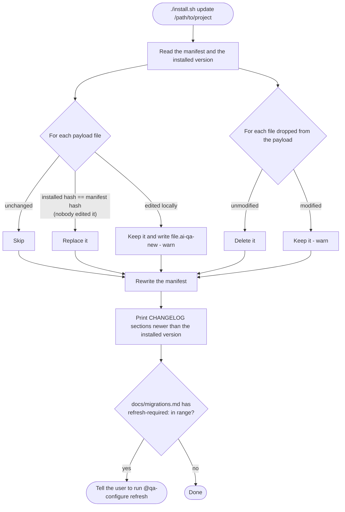
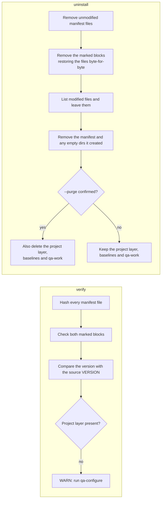

# 1. Install, update, verify and uninstall

These commands are run from a separate AI-QA checkout and target a project repository. `install.sh` and `install.ps1` behave the same way.

## Install

```mermaid
flowchart TD
  A([./install.sh install /path/to/project]) --> B{Target is the AI-QA<br/>checkout itself?}
  B -- yes --> X1[/Refuse and exit/]
  B -- no --> C{Manifest already<br/>exists?}
  C -- yes --> X2[/Refuse: use update or verify/]
  C -- no --> D{Existing qa* agents,<br/>qa-* skills or qa* instructions<br/>not owned by AI-QA?}
  D -- yes, no --prefix --> X3[/Abort and list collisions/]
  D -- "no, or --prefix x" --> E[Stage payload/.github files<br/>rename qa → x if --prefix]
  E --> F{--dry-run?}
  F -- yes --> P[/Print planned writes and exit - nothing changed/]
  F -- no --> G[Copy agents, skills and framework files]
  G --> H[Add or replace the marked pointer block in<br/>.github/copilot-instructions.md<br/>creating the file if absent]
  H --> I[Add the marked qa-work block to .gitignore]
  I --> J[Write .github/ai-qa/manifest.json<br/>with a SHA-256 for every installed file]
  J --> K([Done: open the project in VS Code<br/>and run @qa-configure])
```

## Update



## Verify and uninstall


