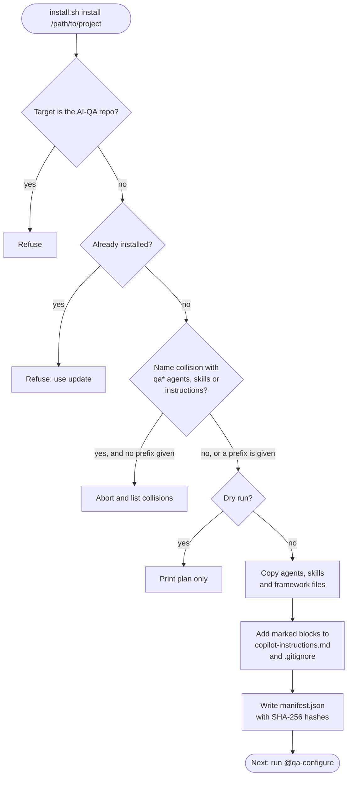
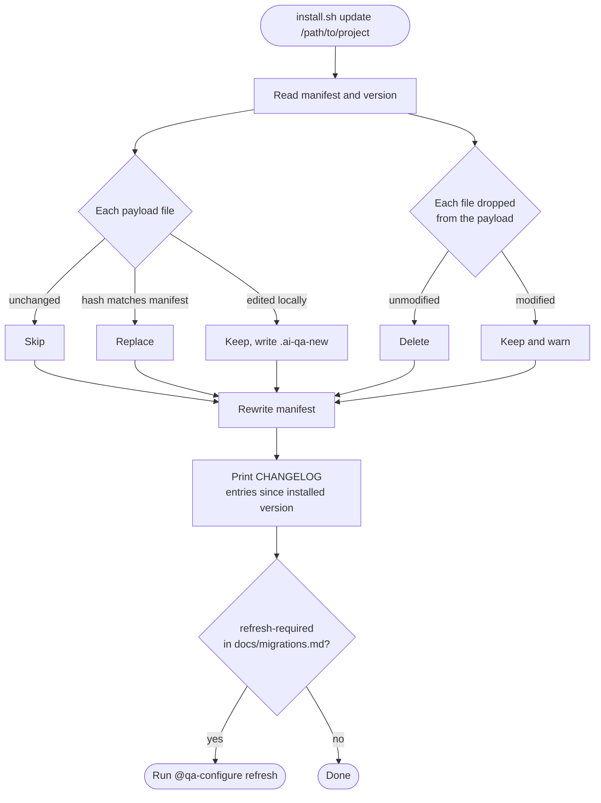
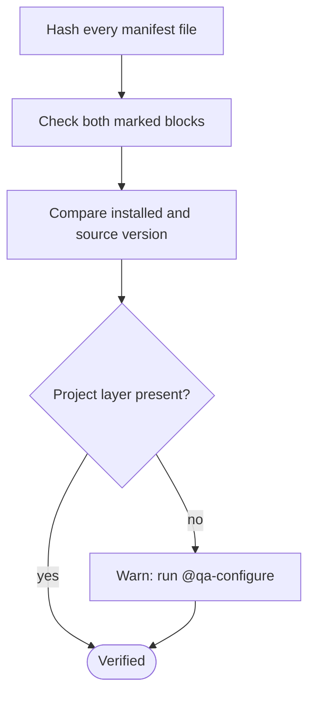
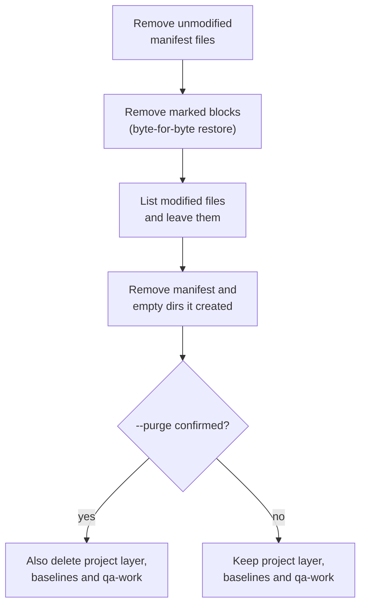

# 1. Install, update, verify and uninstall

Run the installer from a separate AI-QA checkout, pointing at the project. `install.sh` and `install.ps1` behave the same way.

## Install

Collisions are checked against existing `qa*` agents, `qa-*` skills and `qa*` instructions that AI-QA doesn't own. Passing `--prefix x` renames everything from `qa` to `x`.

## Update

## Verify

Verify exits non-zero if any hash or marked block doesn't match.

## Uninstall

