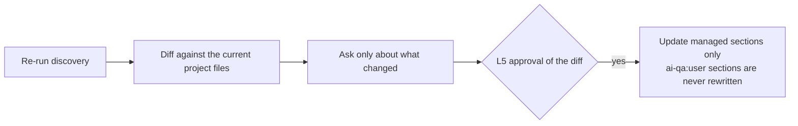

# 2. Configure (`@qa-configure`)

`qa-configure` is the only writer of the project layer. Every step before the L5 gate is read-only.

```mermaid
flowchart TD
  S([User: @qa-configure]) --> P1[1 Preflight<br/>manifest, version, first run or refresh]
  P1 --> P2[2 Local discovery: read-only, method/discovery.md<br/>repo shape · build · frameworks/data · test stack→pack ·<br/>test conventions · execution · CI/CD · git · PRs ·<br/>CODEOWNERS · DoD · docs · integrations · Project Context]
  P2 --> P3[3 Integrations<br/>provider per capability · deployment<br/>*.atlassian.net → Cloud ◐ · self-hosted → Server/DC ◐<br/>confirm via read-only serverInfo probe, else ask once<br/>transports ordered preferred → fallback]
  P3 --> P4{4 User named a Confluence space<br/>or Azure Wiki root?}
  P4 -- yes --> P4a[Remote-docs pass<br/>docs.search / docs.get, index pages first]
  P4 -- no --> P5
  P4a --> P5[5 Confirm<br/>one question at a time, only for ⚠ / ◐ / ? / ∅ findings<br/>evidence + Option A recommended + alternatives<br/>accept all · one optional constraints question<br/>env var NAMES only, never secrets]
  P5 --> P6[6 Defaults for ∅/✗ findings from framework/defaults<br/>marked ★ with the date]
  P6 --> P7[7 Pick a pack per test path<br/>no match → reduced-confidence warning<br/>no framework → ∅, ★ and offer a gated scaffold]
  P7 --> P8{8 Show the exact diff<br/>L5 approval?}
  P8 -- "no / edit request" --> P5
  P8 -- explicit yes --> P9[9 Write the project layer<br/>and rendered instructions<br/>+ .vscode/mcp.json only if MCP chosen]
  P9 --> P10[10 Verify<br/>conventions match cited examples · test command exists<br/>via help/list only, never run · project.md cites sources ·<br/>read-only provider probe]
  P10 --> P11([11 Summary<br/>ready · degraded · first commands · offer qa-baseline])
```

## Refresh (`@qa-configure refresh`)

## What configure reads and writes

```mermaid
flowchart LR
  subgraph reads [Reads - framework, installed]
    M[method/discovery.md · questions.md · safety.md]
    T[templates/*]
    D[defaults/*]
    K[packs/*/pack.md + instructions.template.md]
    PR[providers/operations.md + provider files]
  end
  subgraph writes [Writes - project-owned, L5]
    PJ[.github/ai-qa/project/project.md]
    DS[.github/ai-qa/project/discovery.md]
    CV[.github/ai-qa/project/conventions/<br/>git · testing · qa-process · integrations · reporting]
    IN[.github/instructions/qa-project.instructions.md<br/>.github/instructions/qa-#lt;pack#gt;.instructions.md]
    MC[.vscode/mcp.json - only if MCP chosen]
  end
  reads --> QC((qa-configure)) --> writes
```

