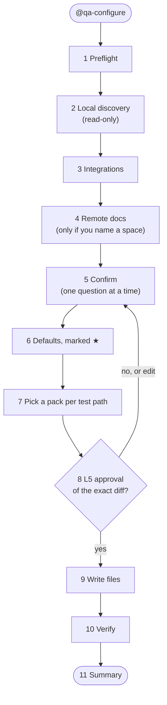
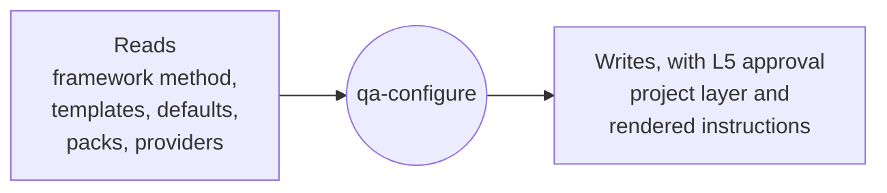
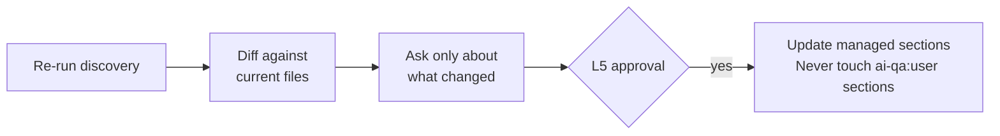

# 2. Configure (`@qa-configure`)

`qa-configure` is the only writer of the project layer. Everything before the L5 approval is read-only.

## The 11 steps

| Step | What happens |
|---|---|
| 1 Preflight | Reads the manifest and version. Decides first run or refresh |
| 2 Local discovery | Follows `method/discovery.md` across repo shape, build, frameworks and data, test stack and conventions, execution, CI/CD, git, PRs, CODEOWNERS, definition of done, docs and integrations. Never runs the test suite |
| 3 Integrations | Picks a provider per capability and identifies the deployment: `*.atlassian.net` → Cloud ◐, a self-hosted URL → Server/DC ◐, confirmed by a read-only `serverInfo` probe or asked once. Orders transports from preferred to fallback |
| 4 Remote docs | Optional second pass over a Confluence space or Azure Wiki root you name. Index pages first |
| 5 Confirm | Asks only about ⚠ conflicts, behaviour-relevant ◐, ? and relevant ∅ findings. Each question shows the evidence and a recommended Option A. "Accept all" and one optional constraints question are supported. Environment-variable names only, never secrets. Also decides the manual scenario format, `bdd` (Given / When / Then) or `steps` (numbered steps with expected results), from how acceptance criteria and existing manual tests are written |
| 6 Defaults | Fills ∅/✗ gaps from `framework/defaults/`, marked ★ with the date |
| 7 Packs | One pack per test path. No match → reduced-confidence warning. No framework → ∅, ★ and an offer of a gated scaffold |
| 8 Approval | Shows the exact diff and waits for an explicit yes |
| 9 Write | Writes the files listed below, plus `.vscode/mcp.json` only if MCP was chosen |
| 10 Verify | Conventions match their cited examples, the test command exists (help/list only, never run), `project.md` cites sources, and a read-only provider probe succeeds |
| 11 Summary | What's ready, what's degraded, first commands, and an offer of `qa-baseline` |

## What it reads and writes

| Writes | Files |
|---|---|
| Project Context | `.github/ai-qa/project/project.md`, `discovery.md` |
| Conventions | `.github/ai-qa/project/conventions/` `git`, `testing`, `qa-process`, `integrations`, `reporting` |
| Instructions | `.github/instructions/qa-project.instructions.md` and one `qa-<pack>.instructions.md` per selected pack |
| MCP | `.vscode/mcp.json`, only if MCP was chosen |

## Refresh

