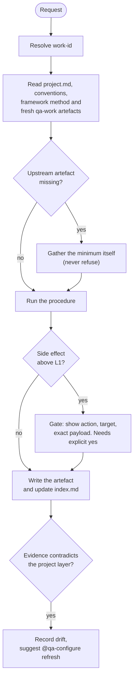
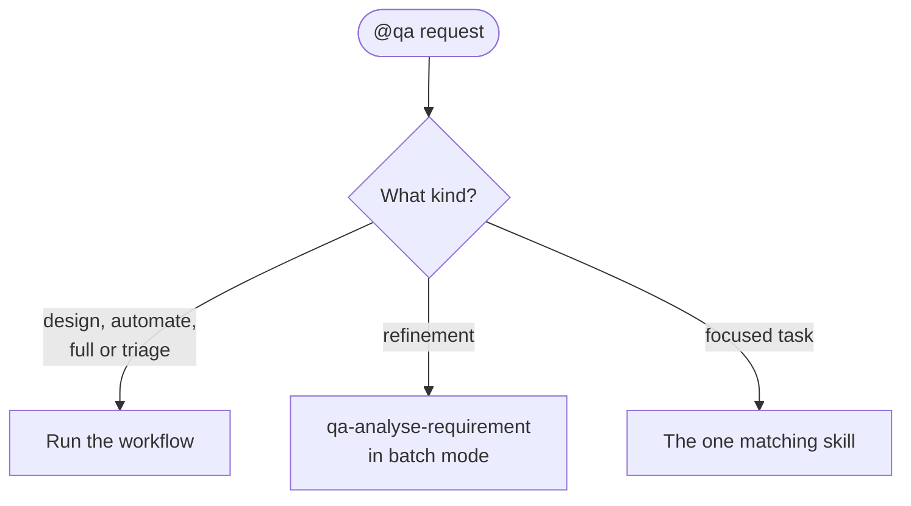
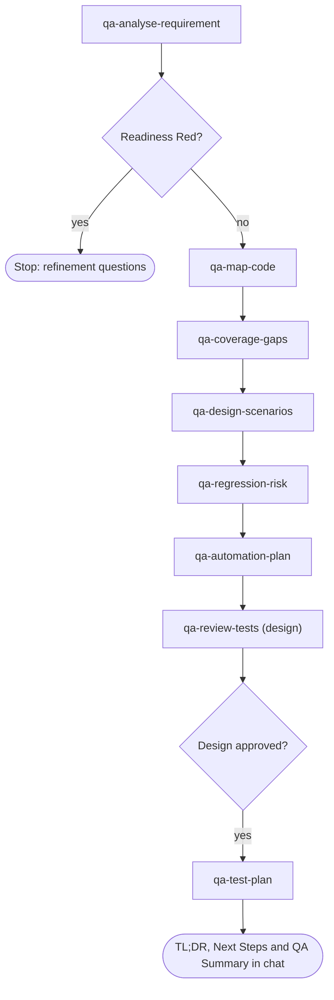
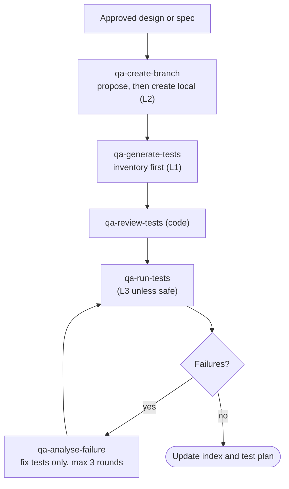
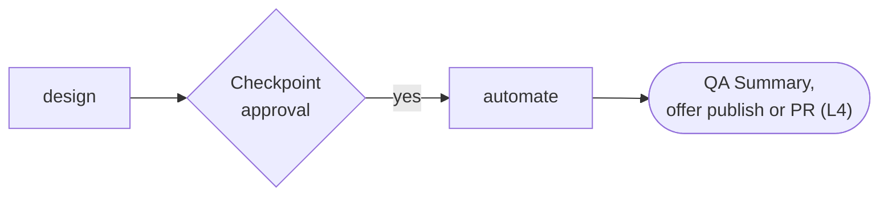
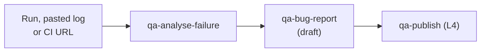
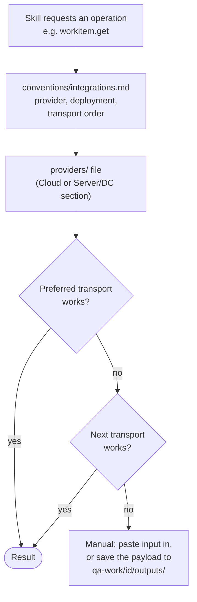

# 3. Using AI-QA (`@qa` and skills)

## What every skill does

The work-id is the explicit argument, else the ticket key in the branch name (via `conventions/git.md`), else `adhoc-<yyyymmdd>-<slug>`.

## Routing through `@qa`

You can also call any `qa-*` skill directly and skip `@qa`.

## design

`qa-map-code` also runs `verify` when you give it a branch. `qa-coverage-gaps` runs at requirement scope. `qa-review-tests` runs as a subagent where the host supports it.

## automate

Installing dependencies is a separate L5 gate.

## full and triage

## External operations

Transports are MCP, CLI (`gh`, `az`) and REST, in the order the project configures. Every L4 write goes through `qa-publish` (PRs through `qa-create-pr`) behind an explicit approval gate.
