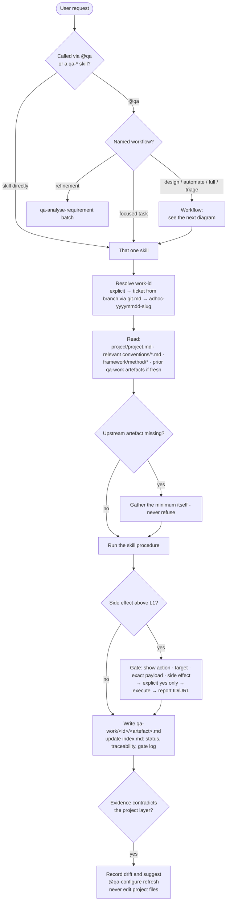
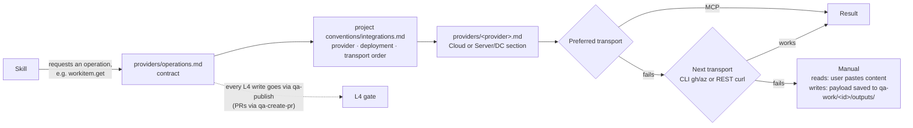

# 3. Using AI-QA (`@qa` and skills)

## Routing and what every skill reads

```mermaid
flowchart TD
  U([User request]) --> Q{Called via @qa<br/>or a qa-* skill?}
  Q -- skill directly --> SK[That one skill]
  Q -- "@qa" --> R{Named workflow?}
  R -- "design / automate / full / triage" --> WF[Workflow:<br/>see the next diagram]
  R -- "refinement" --> BA[qa-analyse-requirement batch]
  R -- focused task --> SK
  WF --> SK
  SK --> W[Resolve work-id<br/>explicit → ticket from branch via git.md → adhoc-yyyymmdd-slug]
  W --> RD[Read:<br/>project/project.md · relevant conventions/*.md ·<br/>framework/method/* · prior qa-work artefacts if fresh]
  RD --> MISS{Upstream artefact missing?}
  MISS -- yes --> GM[Gather the minimum itself - never refuse]
  MISS -- no --> DO
  GM --> DO[Run the skill procedure]
  DO --> G{Side effect above L1?}
  G -- no --> OUT
  G -- yes --> GATE[Gate: show action · target · exact payload · side effect<br/>→ explicit yes only → execute → report ID/URL]
  GATE --> OUT[Write qa-work/#lt;id#gt;/#lt;artefact#gt;.md<br/>update index.md: status, traceability, gate log]
  OUT --> DR{Evidence contradicts<br/>the project layer?}
  DR -- yes --> DRF[Record drift and suggest<br/>@qa-configure refresh<br/>never edit project files]
```

## Workflows

```mermaid
flowchart TD
  subgraph design
    D1[qa-analyse-requirement<br/>FR/NFR IDs · readiness RAG] --> D1R{Red?}
    D1R -- yes --> STOP([Stop: offer refinement questions])
    D1R -- no --> D2[qa-code-context<br/>+ verify if a branch is given]
    D2 --> D3[qa-coverage-gaps requirement]
    D3 --> D4[qa-design-tests<br/>BDD · Covers FRn · Not Written]
    D4 --> D5[qa-regression-risk<br/>13 areas]
    D5 --> D6[qa-automation-plan<br/>automate / manual / not needed]
    D6 --> D7[qa-review-tests design<br/>run as a subagent]
    D7 --> DA{Design approval?}
    DA -- yes --> D8[qa-test-plan<br/>outputs/test-plan.md]
    D8 --> DS([QA Summary shown in chat])
  end
  subgraph automate
    A1[Approved design or spec] --> A2[qa-branch: propose → create local L2]
    A2 --> A3[qa-generate-tests: inventory first<br/>L1 edits · dependency install L5]
    A3 --> A4[qa-review-tests code]
    A4 --> A5[qa-run-tests<br/>L3 unless safe]
    A5 --> A6{Failures?}
    A6 -- yes --> A7[qa-analyse-failure<br/>fix test defects only · max 3 iterations]
    A7 --> A5
    A6 -- no --> A8([Update index and test plan])
  end
  subgraph full
    F1[design] --> F2{Checkpoint approval} --> F3[automate] --> F4([QA Summary · offer qa-publish / qa-create-pr L4])
  end
  subgraph triage
    T1[Run, pasted log or CI URL] --> T2[qa-analyse-failure] --> T3[qa-bug-report draft] --> T4[qa-publish L4]
  end
```

## External operations (provider layer)

```mermaid
flowchart LR
  SK[Skill] -- "requests an operation,<br/>e.g. workitem.get" --> OP[providers/operations.md<br/>contract]
  OP --> CFG[project conventions/integrations.md<br/>provider · deployment · transport order]
  CFG --> PF[providers/#lt;provider#gt;.md<br/>Cloud or Server/DC section]
  PF --> T1{Preferred transport}
  T1 -- MCP --> OK
  T1 -- fails --> T2{Next transport<br/>CLI gh/az or REST curl}
  T2 -- works --> OK[Result]
  T2 -- fails --> MAN[Manual<br/>reads: user pastes content<br/>writes: payload saved to qa-work/#lt;id#gt;/outputs/]
  OP -. "every L4 write goes via qa-publish<br/>(PRs via qa-create-pr)" .-> GATE[L4 gate]
```
