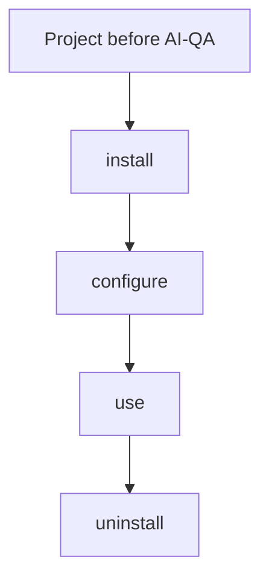

# 4. File lifecycle in a target project

Legend: `+` created, `~` modified, `-` removed, `=` kept.

## install (installer)

| | File |
|---|---|
| + | `.github/agents/qa.agent.md`, `qa-configure.agent.md` |
| + | `.github/skills/qa-*/` (21 skills) |
| + | `.github/ai-qa/framework/**` (method, providers, packs, defaults, templates) |
| + | `.github/ai-qa/manifest.json` |
| ~ | `.github/copilot-instructions.md`: marked block added, file created if absent |
| ~ | `.gitignore`: marked `qa-work` block added, file created if absent |

## configure (`qa-configure`, L5)

| | File |
|---|---|
| + | `.github/ai-qa/project/project.md`, `discovery.md` |
| + | `.github/ai-qa/project/conventions/` (5 files) |
| + | `.github/instructions/qa-project.instructions.md` |
| + | `.github/instructions/qa-<pack>.instructions.md`, one per selected pack |
| + | `.vscode/mcp.json`, only if MCP was chosen |

## use (`qa` and skills)

| | File | Notes |
|---|---|---|
| + | `qa-work/<id>/index.md`, `outputs/` | Committed by default |
| + | `qa-work/<id>/*.md`, `logs/` | Git-ignored by default |
| + | `.github/ai-qa/baselines/<date>.md` and `.json` | `qa-baseline` |
| +/~ | Test files | `qa-generate-tests`, L1, non-default branch only |
| ~ | Docs | `qa-update-docs`, L1 |
| | Local branch or commit | L2 |
| | Push, PR, comments, pages | L4 |

## uninstall (installer)

| | What |
|---|---|
| - | Every unmodified file AI-QA installed, and the manifest |
| - | The two marked blocks. `copilot-instructions.md` and `.gitignore` are deleted only if AI-QA created them and they are now empty |
| = | Modified framework files, which are listed |
| = | Project layer, baselines and `qa-work`, unless `--purge` is confirmed |
