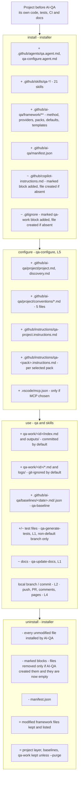

# 4. File lifecycle in a target project

This shows which files exist at each stage, and who creates, changes or removes them.

```mermaid
flowchart TD
  P0[Project before AI-QA<br/>its own code, tests, CI and docs] --> I

  subgraph I [install - installer]
    I1[+ .github/agents/qa.agent.md, qa-configure.agent.md]
    I2[+ .github/skills/qa-*/ - 21 skills]
    I3[+ .github/ai-qa/framework/** - method, providers, packs, defaults, templates]
    I4[+ .github/ai-qa/manifest.json]
    I5[~ .github/copilot-instructions.md - marked block added, file created if absent]
    I6[~ .gitignore - marked qa-work block added, file created if absent]
  end

  I --> C
  subgraph C [configure - qa-configure, L5]
    C1[+ .github/ai-qa/project/project.md, discovery.md]
    C2[+ .github/ai-qa/project/conventions/*.md - 5 files]
    C3[+ .github/instructions/qa-project.instructions.md]
    C4[+ .github/instructions/qa-#lt;pack#gt;.instructions.md - per selected pack]
    C5[+ .vscode/mcp.json - only if MCP chosen]
  end

  C --> U
  subgraph U [use - qa and skills]
    U1[+ qa-work/#lt;id#gt;/index.md and outputs/ - committed by default]
    U2[+ qa-work/#lt;id#gt;/*.md and logs/ - git-ignored by default]
    U3[+ .github/ai-qa/baselines/#lt;date#gt;.md/.json - qa-baseline]
    U4[+/~ test files - qa-generate-tests, L1, non-default branch only]
    U5[~ docs - qa-update-docs, L1]
    U6[local branch / commit - L2 · push, PR, comments, pages - L4]
  end

  U --> X
  subgraph X [uninstall - installer]
    X1[- every unmodified file installed by AI-QA]
    X2[- marked blocks - files removed only if AI-QA created them and they are now empty]
    X3[- manifest.json]
    X4[= modified framework files kept and listed]
    X5[= project layer, baselines, qa-work kept unless --purge]
  end
```

Legend: `+` created · `~` modified · `-` removed · `=` kept.
