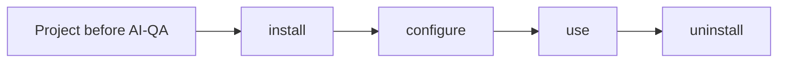
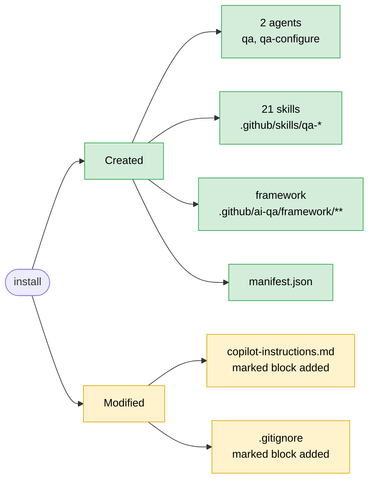
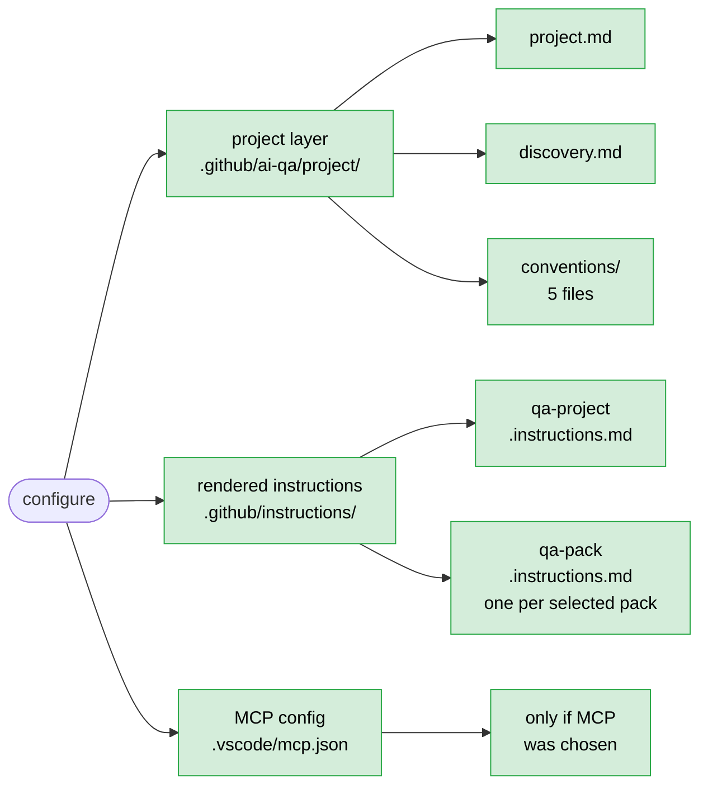
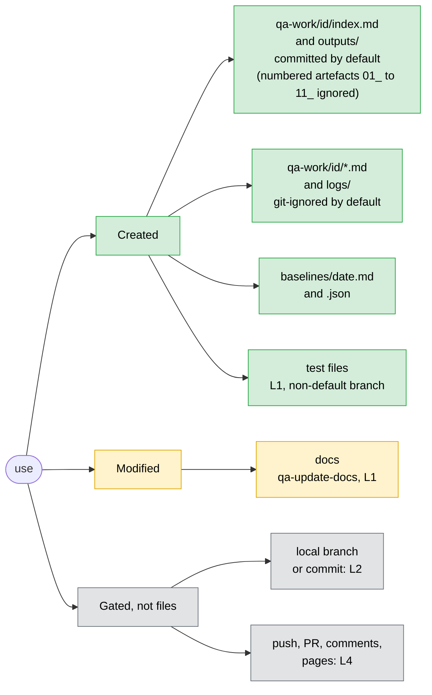
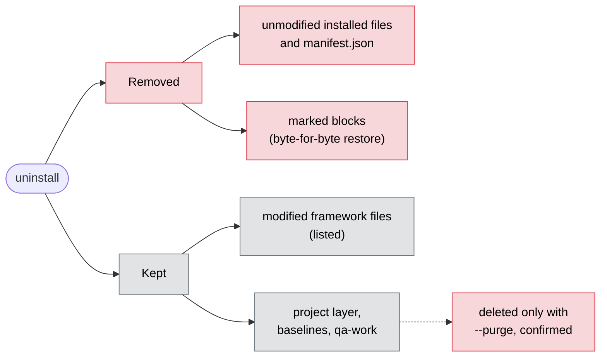

# 4. File lifecycle in a target project

Each diagram shows what one stage does to the project's files. Green is created, amber is modified, red is removed and grey is kept.

## install (installer)

Either modified file is created if it doesn't exist. Nothing is removed, and no project code, tests, CI or docs are touched.

## configure (`qa-configure`, L5)

On refresh, only the managed sections of these files change. Framework files, code, tests and dependency manifests are never touched.

## use (`qa` and skills)

Product code is never changed by the fix loop. Tests are never deleted, skipped or disabled. The default branch is never edited, and nothing is merged.

## uninstall (installer)

`copilot-instructions.md` and `.gitignore` are deleted only if AI-QA created them and they are now empty.
